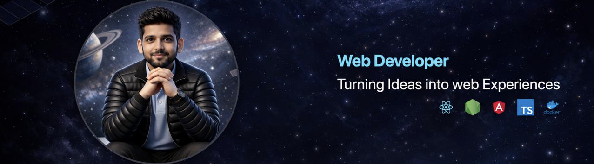

<!-- Custom Banner -->

  

  I build thoughtful, scalable web products with strong ownership over user flows, UI clarity, and overall product experience.

---

## 👨‍💻 About

Frontend / Full Stack Developer with **2+ years of professional experience**, working across **startups, enterprise platforms, and freelance projects**.

I focus on **clean user flows, maintainable UI systems, and end-to-end feature ownership**. I approach development with a **product mindset**, often thinking through features from a user and business perspective, similar to how a product manager would.

Comfortable working in **remote, async-first environments**, collaborating across time zones through clear communication and documentation.  
Currently expanding deeper into **backend systems, system design, and DevOps (Docker)**.

---

## 💼 Experience

- **Network People Services Technologies Ltd.** — Associate Developer  
  _Building and maintaining large-scale enterprise web platforms using Angular and React._

- **Freelance Frontend / Full Stack Developer**  
  _Delivered production-ready products including EP E-Auction Platform, EdTech dashboards, and SaaS interfaces._

- **Patent Ninja** — Founding Engineer (Frontend)  
  _Led frontend development for a product-focused startup, owning core workflows and UX._

---

## 🛠 Tech Stack

**React, Angular, Next.js, TypeScript, JavaScript, Tailwind CSS, HTML, CSS, Redux, Node.js, Firebase, MongoDB, MySQL, REST APIs, Swagger, WebSockets, Git, GitHub, Postman, Jest, Docker (learning)**

---

## 🧩 How I Work

- Strong focus on **clear user flows and intuitive UI**
- Prefer owning **features end-to-end**
- Think in terms of **product impact**, not just implementation
- Comfortable with **remote collaboration and async communication**
- Value simplicity, clarity, and long-term maintainability

---

## 🚀 Selected Projects

### 🎓 Effort Education  
**EdTech Startup | Full Stack**

- Built a **dashboard-driven learning platform** using **Next.js**
- Designed structured user flows for content access and progress tracking
- Focused on usability, clarity, and scalable UI architecture

---

### 🌌 Venture Universe _(In Development)_

- Space and astronomy platform featuring **interactive 3D visuals (Three.js)**
- Community-focused design with modern frontend architecture

---

## 📄 Resume & Portfolio

- 📑 Resume (2025):  
  https://drive.google.com/file/d/1AMz0QLvoDz_3i9uupdPR31seGsHPPdhr/view
- 🌐 Portfolio:  
  https://myselfabhi.vercel.app

---

## 🌍 Connect

  
  
  

---

## 📊 GitHub Activity

  <picture>
    <source
      srcset="https://github-readme-stats.vercel.app/api?username=myselfabhi&show_icons=true&hide_title=true&theme=github_dark"
      media="(prefers-color-scheme: dark)"
    />
    <source
      srcset="https://github-readme-stats.vercel.app/api?username=myselfabhi&show_icons=true&hide_title=true&theme=default"
      media="(prefers-color-scheme: light)"
    />
    
  </picture>

  <picture>
    <source
      srcset="https://github-readme-streak-stats.herokuapp.com/?user=myselfabhi&theme=github-dark"
      media="(prefers-color-scheme: dark)"
    />
    <source
      srcset="https://github-readme-streak-stats.herokuapp.com/?user=myselfabhi&theme=default"
      media="(prefers-color-scheme: light)"
    />
    
  </picture>

